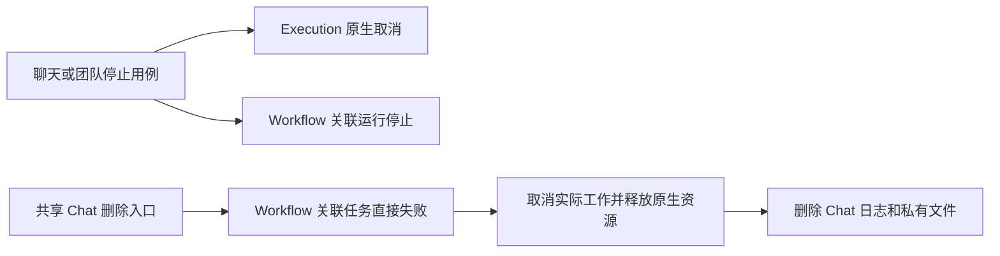
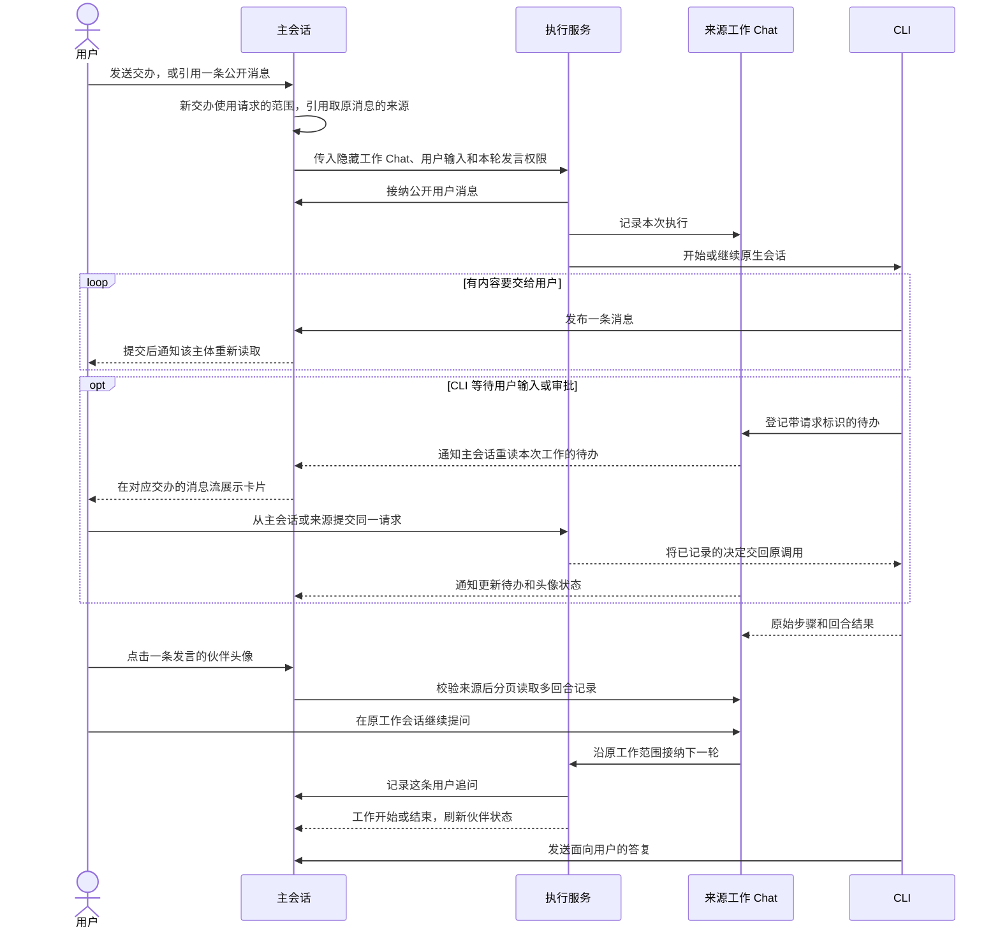
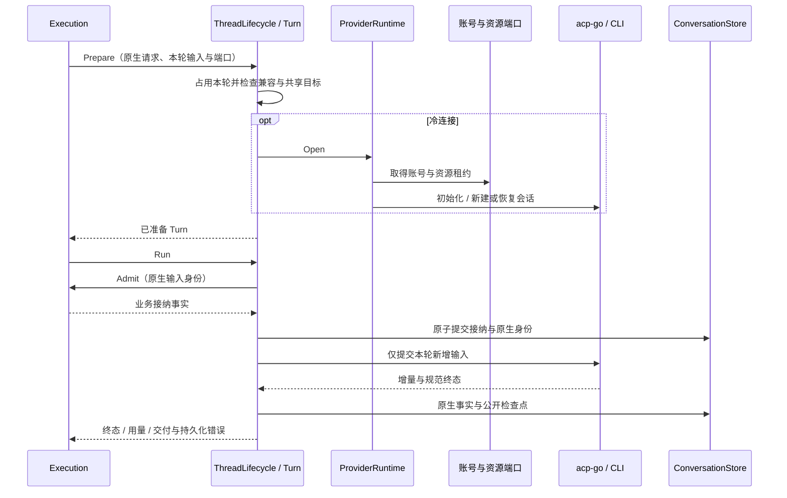
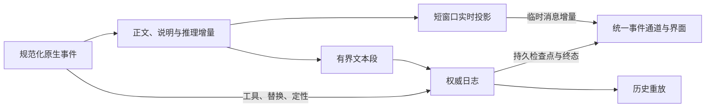

# 聊天与执行

## 数据与职责

工作 Chat 是执行消息与原生会话的容器。用户输入、结构化执行事件和终态结果写入追加式 JSONL；查询索引与当前消息投影可以重建。SQLite 保存聊天聚合摘要、查询定位和其他业务数据，不另存一套 Execution 状态或可编辑聊天正文。

Execution 负责中立工作意图、权限和配置校验、业务接纳、执行终态及取消。`ThreadLifecycle` 按 Chat 维护原生绑定和配置兼容；`Turn` 拥有本轮输入；`ProviderRuntime` 独占原生进程、账号与资源租约。共享 cwd 不合并聊天身份或原生进程。

Execution 只取消实际原生执行并管理其资源收尾。聊天与团队的公开停止用例分别调用 Execution 和 Workflow，按原提交回执或确切 Execution 身份停止关联运行；执行注册表不反向编排 Workflow。工具能力的 Context 直接属于该执行，取消即撤销工具访问。

共享会话删除入口拥有删除顺序，领域任务的失败规则见[工作流](workflows-cn.md#授权与失败)。

```mermaid
flowchart LR
  Stop[聊天或团队停止用例] --> Native[Execution 原生取消]
  Stop --> Run[Workflow 关联运行停止]
  Delete[共享 Chat 删除入口] --> Fail[Workflow 关联任务直接失败]
  Fail --> Release[取消实际工作并释放原生资源]
  Release --> Files[删除 Chat 日志和私有文件]
```

`agent.Catalog` 保留 CLI 安装、Profile 与程序定位，acp-go 拥有原生协议和客户端。Chat 与运行时共用 ConversationStore，查询投影不复制执行权威。职责详见[智能体与账号](runtimes-and-accounts-cn.md)。

## 主会话和来源工作记录

主会话由 `(subjectType, subjectId)` 唯一定位。伙伴与团队共用公开消息表、发送入口和来源读取入口。团队的新交办使用其负责人的成员配置，伙伴用自己的模型选择或本机保存的默认智能体。普通聊天继续由工作 Chat 承载。

```mermaid
sequenceDiagram
    actor U as 用户
    participant M as 主会话
    participant E as 执行服务
    participant J as 来源工作 Chat
    participant C as CLI
    U->>M: 发送交办，或引用一条公开消息
    M->>M: 新交办使用请求的范围，引用取原消息的来源
    M->>E: 传入隐藏工作 Chat、用户输入和本轮发言权限
    E->>M: 接纳公开用户消息
    E->>J: 记录本次执行
    E->>C: 开始或继续原生会话
    loop 有内容要交给用户
        C->>M: 发布一条消息
        M-->>U: 提交后通知该主体重新读取
    end
    opt CLI 等待用户输入或审批
        C->>J: 登记带请求标识的待办
        J-->>M: 通知主会话重读本次工作的待办
        M-->>U: 在对应交办的消息流展示卡片
        U->>E: 从主会话或来源提交同一请求
        E-->>C: 将已记录的决定交回原调用
        J-->>M: 通知更新待办和头像状态
    end
    C-->>J: 原始步骤和回合结果
    U->>M: 点击一条发言的伙伴头像
    M->>J: 校验来源后分页读取多回合记录
    U->>J: 在原工作会话继续提问
    J->>E: 沿原工作范围接纳下一轮
    E->>M: 记录这条用户追问
    E-->>M: 工作开始或结束，刷新伙伴状态
    C->>M: 发送面向用户的答复
```

主会话的桌面输入框提交交办正文和执行选项。目录属于具体工作，普通聊天草稿里选择的项目不会随主会话提交。工作来源按会话、实际伙伴和授权范围复用。新的项目交办按当时的配置选择来源，回复按原消息的来源继续工作。临时目录以接纳时解析出的真实路径为准。原选择的路径单独用于核对用户重试，即便目录随后移走，已接纳提交仍可返回原回执。团队更换负责人后，新交办使用新负责人。引用旧交办仍由原执行伙伴在原范围续办，前提是这位伙伴仍为团队成员。

公开消息存入 SQLite，工作过程由 Chat 日志保存。用户提交使用同一提交标识重试，模型发言使用本次工具调用的原请求标识重试。显式发布成功立即取得公开消息标识。原生回合成功结束时，如果只消费了这次交办、没有尝试公开发言，且没有提问、审批或宿主命令，Core 可以沿原回址交付一次已保存的最终答复。CLI 使用原生工具后给出的明确 final 也可交付，命令、工具输出和旁白保留在工作记录。WorkBuddy 仅返回 ACP end_turn 时，Core 只接受可确认的单块助手正文，含工具活动的流式内容仍须显式发言。Core 在提交执行终态前结算这次补发。提取或交付失败时，原交办显示交付错误，原生结果仍可在来源工作记录查看。主会话先预留交办身份，来源日志确认接纳后才公开。若写执行日志失败，可用同一提交标识重试。Core 重启时用原执行回执补齐已接纳的公开交办。后台事件、工单和工作流投递的目标设计见[统一会话架构](../discussions/superagent-conversation-architecture-cn.md)。

两个视图使用同一个聊天输入组件。两个入口提交的用户正文都写入主会话。在工作记录里发送时，宿主将新回合交给当前工作 Chat。伙伴发给用户的答复逐条写入公开时间线，工具步骤和运行旁白保存在来源。读取主会话时，Core 在同一事务内返回消息页和各来源的当前执行。每次执行带上原交办的公开消息标识，以及该执行是否已有公开答复。后者取自已提交的发言，翻页与重连均按同一执行判断。前端按伙伴、来源 Chat 与原交办组织连续发言。首条公开答复随快照出现时收起等待行，头像和名称直接挂在组首，同组后续发言沿用正文列。组首头像可打开工作记录，关联执行运行时播放工作动效，原生回合结算后原位转为静态。兼容的 CLI 连接可供下一轮复用。

删除单条消息只改变它在主会话中的可见性。公开历史、回复定位和未读统计排除该条消息。原消息顺序、送达回执及来源执行记录继续参与对账，已经接纳的工作仍可发布新答复。伙伴发言的分支按来源 Chat 和这条发言对应的回合调用现有分支流程。

读取一页工作记录时，Core 同时返回这一页各次执行实际发到主会话的消息。桌面按执行标识把发言放回对应回合，按公开顺序展示每一段。CLI 的工具调用、返回值和收尾文字仍可在该回合查看。没有公开发言的回合沿用普通聊天的结果展示。

来源 Chat 保存 CLI 的待答问题与审批。主会话先读各工作是否等待，再按主体和工作身份读取待办快照，核对当前执行后，将卡片放在对应交办的消息流。工作记录中的卡片随消息一起滚动。两个入口共用普通聊天的卡片和提交逻辑，提交回到发起请求的工作。待办变化使同一主体的客户端重新读取快照，卡片与侧栏头像随之更新。已处理的问答可在来源工作记录回看。

主会话和工作记录将各自的消息内容放入普通聊天的工作台外壳，共用顶栏概览、侧栏开关及文件查看器。主会话可跨项目查看已经公开的附件，打开文件时使用发出这条消息的工作 Chat。来源记录使用实际工作目录提供项目文件和 Diff。富媒体用户输入的公开行关联来源消息，桌面读取原消息已冻结的附件与代码引用，CLI 读公开历史时沿用文件名摘要。

### 按能力找文件

沿一次交办阅读时，从 `send.go` 开始。新交办在 `assignment.go` 确定工作范围，引用旧消息在 `reply.go` 恢复原来源。CLI 主动发布的正文由 `messages.go` 接纳，用户点击头像后通过 `source_history.go` 读取原工作记录。

| 要修改的行为 | 代码入口 |
| --- | --- |
| 打开伙伴或团队的固定主会话，加载更早的公开消息 | [open.go](../../server/apis/main_conversations/open.go) 处理 HTTP 查询。[subject.go](../../server/services/mainconversation/subject.go) 管主体身份及唯一会话地址。 |
| 接纳新交办，或处理同一次用户提交的重试 | [send.go](../../server/apis/main_conversations/send.go) 串起提交回执、来源选择、执行准入和公开用户消息。[assignment.go](../../server/apis/main_conversations/assignment.go) 选择实际伙伴、CLI 配置与授权目录。 |
| 引用一条发现并继续原工作 | [reply.go](../../server/apis/main_conversations/reply.go) 校验消息归属，以原作者角色提供有界摘录。[work_source.go](../../server/services/mainconversation/work_source.go) 管来源绑定和成员资格。 |
| 为已授权范围创建或续用隐藏工作 Chat | [main_conversation_source.go](../../server/services/execution/main_conversation_source.go) 使用冻结的项目和目录准备来源，再进入通用 CLI 执行器。 |
| 改变 CLI 能看到哪些公开消息、能往哪里发言 | [命令定义](../../server/internal/agent/capability/main_conversation.go) 定义工具参数。[执行授权](../../server/services/execution/main_conversation_tools.go) 绑定本轮主体和回址。[messages.go](../../server/services/mainconversation/messages.go) 保存公开正文并返回可重查的回执。 |
| 修改公开存储、顺序或来源释放规则 | [主会话存储](../../server/repositories/controllers/main_conversation.go)、[工作来源存储](../../server/repositories/controllers/main_conversation_work.go)、[公开消息存储](../../server/repositories/controllers/main_conversation_messages.go) 共用一个仓储和事务。 |
| 订阅已提交的公开消息 | [主会话订阅](../../server/apis/events/main_conversations.go) 校验准确的伙伴或团队。[前端查询](../../packages/frontend/src/modules/chat/api/main-conversation.ts) 提供公开消息和来源记录的分页读取。 |
| 点伙伴头像和名称回主会话，点「＋」开普通对话 | [伙伴聊天页签栏](../../packages/frontend/src/app/layout/partner-conversation-tab-strip.tsx) 固定当前伙伴入口并展示其普通对话。[主体导航](../../packages/frontend/src/app/layout/use-subject-chat-navigation.ts) 处理打开与新建，[主会话路由](../../packages/frontend/src/app/scenes/main-conversation-route.ts) 确定页签身份。 |
| 编写交办、显示逐条发言 | [原聊天输入组件](../../packages/frontend/src/modules/chat/components/chat-composer-panel.tsx) 管理编辑、附件、资源与执行选项。[主会话提交](../../packages/frontend/src/modules/chat/components/main-conversation-composer.tsx) 选择公开或来源发送地址，[消息组件](../../packages/frontend/src/modules/chat/components/main-conversation-message.tsx) 显示发言和来源入口。 |
| 在两种会话视图处理同一提问或审批 | [时间线交互卡](../../packages/frontend/src/modules/chat/components/chat-timeline-interactions.tsx) 渲染普通聊天的提问和审批控件。[请求处理](../../packages/frontend/src/modules/chat/model/main-conversation-source-requests.ts) 提交并刷新主会话和来源。[服务端入口](../../server/apis/main_conversations/source_interaction.go) 校验工作归属与执行者后交回原执行。 |
| 点头像查看工作记录并返回 | [source_history.go](../../server/apis/main_conversations/source_history.go) 校验来源、返回原 Chat 的多回合历史。[来源续聊](../../server/apis/main_conversations/source_send.go) 核对主体与原来源后接纳新输入。[来源视图](../../packages/frontend/src/modules/chat/components/main-conversation-source.tsx) 展示执行步骤并可继续输入，[主会话页](../../packages/frontend/src/modules/chat/pages/main-conversation-page.tsx) 保留原聊天的阅读位置与草稿。 |

## 输入与接纳

草稿在首次发送前保持本地。服务在真实接纳点形成执行身份与消息事实；未接纳输入不能伪装成已发送。客户端请求身份区分正在接纳、成功接纳与结果不确定，避免重复首次发送。

客户端先按实际请求内容准备已有幂等身份，再创建临时消息和提交请求。用户与助手消息、安全事件及接纳回执复用同一 `submissionId` 关联；首发映射创建请求的 `clientRequestId`，续聊从发送入口传递原提交身份。持久事实可以先于 HTTP 回执抵达，前端按明确关联接管临时输入，不比较正文或猜测下一个消息。

发送回执错误只属于产生它的页面。重载时通过原会话历史恢复已接纳的消息，同一提交的持久事实到达时清除当次错误。

点击发送后，界面立即沿本次提交状态显示“工作中”和停止入口，不等待 Chat ID 或后端接纳；准备失败后恢复输入并显示对应错误。该交互反馈不提前生成已接纳的服务端消息事实。

续聊使用原 Chat 的工作范围和可用原生会话。运行中输入按能力进入即时输入或临时队列；输入未被接纳前仍可编辑。队列不作为已提交消息权威。

消息回复随本次提交固定一个原消息标识。Core 在同一 Chat 的权威记录中按标识查找目标，校验可回复正文。仅发送附件或代码引用时，自动生成的占位正文随消息标记。历史只有正文时沿用已有引用判定。目标不可用时拒绝本次发送。接纳后，回复关系、原作者角色和保留换行的短预览随用户消息保存，历史与实时投影沿用同一消息事实。分叉继承回复时，使用新 Chat 内继承消息的标识。团队回复的校验和路由见[团队协作](teams-cn.md#派发与报告)。

执行准备分开读取当前 Chat/原生续接、精确提交收据、指定执行和明确历史交接，不使用完整消息聚合作为通用上下文。一次已有 Chat 接纳在原操作占位中读取一次当前上下文；热续发不读取历史窗口。新原生会话才按配置选择最近可交接的完整成功轮，再读取所需正文并应用总量上限；失败、取消和内部消息不占用完整成功轮的数量，正文超限按既有规则裁剪。

指定执行、首次执行与原提交收据通过可重建定位索引找到 JSONL 的准确位置。定位索引只保存原身份、序号及已覆盖游标，不拥有状态或消息；覆盖落后只追平日志尾部，缺失和损坏走原权威恢复。详情文件差异、真实分叉和显式摘要继续按各自需求读取，不进入普通热续聊。

聊天目录只返回游标页，不附带默认项目的全历史查询。普通伙伴与团队草稿在所属伙伴确定后按需查询最近可用项目；候选按活动游标有界推进，失效项目不会令有效的更早候选被任意截断。已有 Chat、运行中发送和终态不重新查询草稿默认项目。

Execution 解析一次有效选择，直接构造 ThreadRequest、TurnRequest 与 TurnPorts，再调用 ThreadLifecycle.Prepare。用户原文进入原生正文块，引用、选择、团队结果与交接进入本轮上下文，由 Agent 在协议出口统一编码。固定提示通过[原生会话指令](runtimes-and-accounts-cn.md)交付，输入格式见[模型指令与消息组装](../development/model-input-cn.md)。普通聊天共享伙伴固定 cwd，私有日志与附件始终按 Chat 隔离，具体目录见[工作区与存储](workspace-and-storage-cn.md)。

准备阶段判断原生绑定是否兼容。冷准备通过既有端口取得账号和资源，由 ProviderRuntime 接管实际及部分取得的租约，再初始化原生会话；热续聊保留连接和租约。输入提交前，Turn 通过 Admit 端口提交接纳事实，再发送同一输入。持久编排入口可先提交待执行事实，后续规范接纳批次补充原生输入身份；资源准备成功不能代替输入接纳。

从主会话或对应的工作记录续聊时，若 Codex 明确返回本次请求的旧线程没有可恢复的历史，且没有待核对的交接，准备阶段可在原工作 Chat 中新建一次原生会话。新会话沿用同一工作范围、账号和模型，按现有规则携带近期对话。接纳和派发继续使用原提交标识。连接中断、超时或通用运行时错误仍沿原请求对账。

排查发送失败时，用 HTTP 请求日志中的 trace ID 搜索 Core 日志的 `trace_id`。接纳前的 `native execution preparation failed` 给出工作 Chat、执行标识和失败阶段；同一 trace 的 `native agent operation failed` 记录失败的适配器操作、应用错误码，以及可取得的原生 RPC 错误码和原因。自动恢复时，`action=start_replacement` 的 `opened` 表示 CLI 是否返回了不同的新会话标识。已接纳执行在后台失败时，`native execution settlement failed` 沿用发送请求的 trace，区分原生执行、存储、事件交付和清理故障。

热续聊读取不可变版本摘要、发布目标和必要共享配置声明，不执行完整插件准备、源内容摘要或秘密解密。冷获取核对实际交付与声明一致，并取得资源租约；外部篡改源内容在冷获取或显式刷新时发现。共享技能和账号的所有权见[工作范围与资源](runtimes-and-accounts-cn.md#工作范围与资源)。

审批、提问与当前工具范围随执行接纳和结束，软件能力连接沿用[会话工具连接](agent-capabilities-cn.md#授权与请求)。活动消费者不能被管理操作替换，闲置消费者关闭确认后释放所属资源。关闭失败保留原所有者供重试。执行使用独立 Context，后台工作不随接纳请求结束而取消。放弃的准备和迟到的部分资源由同一所有者清理。

```mermaid
sequenceDiagram
  participant Execution
  participant Thread as ThreadLifecycle / Turn
  participant Provider as ProviderRuntime
  participant Resources as 账号与资源端口
  participant CLI as acp-go / CLI
  participant Store as ConversationStore
  Execution->>Thread: Prepare（原生请求、本轮输入与端口）
  Thread->>Thread: 占用本轮并检查兼容与共享目标
  opt 冷连接
    Thread->>Provider: Open
    Provider->>Resources: 取得账号与资源租约
    Provider->>CLI: 初始化 / 新建或恢复会话
  end
  Thread-->>Execution: 已准备 Turn
  Execution->>Thread: Run
  Thread->>Execution: Admit（原生输入身份）
  Execution-->>Thread: 业务接纳事实
  Thread->>Store: 原子提交接纳与原生身份
  Thread->>CLI: 仅提交本轮新增输入
  CLI-->>Thread: 增量与规范终态
  Thread->>Store: 原生事实与公开检查点
  Thread-->>Execution: 终态 / 用量 / 交付与持久化错误
```

## 实时与恢复

持久事件使用领域游标，临时流式事件只描述当前过程。事件通过统一资源通道交付；连接中断、序号缺口和缓冲超限后读取权威历史或快照。恢复期间保留已有内容及未知状态，不假定执行结束。

聊天查询各有明确用途：接纳回执提供已经提交的聊天事实，实时流展示尚未持久化的过程；连续持久消息事件携带完整安全消息快照；独立文件成果事件携带目标消息及轻量引用。两者合并原消息 Query Cache 并推进持久游标。正常终态不重复读取最近五十条；首次进入、刷新、断线、缺口及无法证明连续性时才补读权威快照或增量。只取最新一条不能替代完整恢复。插件输入候选按所选伙伴读取轻量固定版本引用，只随相关安装、启停、版本或展示资料变化更新；共享配置、授权与使用变化不重取候选。分叉能力随消息窗口和原持久事件增量投影，不另读全历史候选；忙碌条件由会话事实决定，仅末轮能力使用最新窗口的目标身份，旧分页不提供该全会话身份。伙伴聊天活动不触发无关团队目录刷新。同查询的事件合并与隐藏恢复遵守[查询与事件所有权](notifications-and-work-board-cn.md#查询与事件所有权)。

消息所有者统一处理初始窗口、连续事件、分页、游标和临时消息接管。页面只装配输入、路由和元数据刷新，不在执行完成回调中决定是否重读消息；不保存另一份需要被动同步的权威历史。原始持久事件先完整投影，渲染批次才可按消息合并；临时流不推进持久游标，迟到快照不能覆盖较新事实。

首发接纳保留已有消息、头像和聊天组件的呈现身份；草稿转真实 Chat 时不以身份同步或后台补读为由切回骨架屏。没有内容的首次加载仍显示骨架。运行标记服从执行终态，正文已显示不等于 CLI 已结束；CLI 返回前可能仍有工具或原生收尾，不能由最后一个文本片段推测终态。

Scene 或嵌入工作区既有身份拥有消息视图生命周期，服务器 Chat ID 只绑定数据源。首发交接沿用原呈现身份；真正切换聊天时重建对应消息所有者及 assistant-ui view，不能先显示上一会话再通过 Effect 修正。

ConversationStore 按当前批次格式写入 JSONL。Execution 的终止结论从该执行绑定的原生结果读取，缺少持久结果时返回 unknown。普通聊天的 Completed 表示业务执行已完成。要求完整结果的调用方还必须检查原生停止原因和失败状态。

运行中的追加指令（steer）沿用取消原调用后继续提交的执行机制；接纳事实记录其接续的原执行标识。界面只连接相邻且身份匹配的取消段，保留追加输入与各段过程、文件成果，在末段统一展示耗时、用量及复制操作；普通停止和之后独立发送不合并。队列交接期间暂时隐藏原段取消提示与收尾操作，追加发送被拒绝后恢复原段状态。刷新与历史重放从同一接纳事实恢复关系。

聊天停止与插队使用点击时的执行标识。接纳回执抵达前按原提交标识停止，首发同时携带原伙伴或团队身份。注册表在同一占位边界处理先到的停止。原生接纳请求退出和内部监听补偿只取消所观察的原生执行，工作流仍按原运行结算。

最近一条助手消息使用动态头像，更早的消息保留头像列占位，以保持正文对齐。末尾追加用户消息时继续显示最近一条助手消息的头像。

助手仍在运行且尚无可见内容时，完整头像旁显示三点。发送新会话的首条消息时，同一行立即显示「正在建立会话」，文字沿用工具执行的扫光动效。创建请求返回成功回执后收起文字。收到可见内容或需要用户处理的交互后收起三点，正文和操作仍由原消息事实驱动。

过程投影按发生顺序组合说明、思考与工具活动。最终正文独立显示，工具名称、输入和结果经过统一语义摘要；文件、敏感值与原始诊断遵守展示边界。

工具展示从标准 ACP 的 `title`、`kind` 和输入参数派生；已知工具名使用业务短语，缺少具体参数时保留原生可读标题。命令优先读取结构化参数，执行类事件也支持以原生标题承载命令；意图描述与命令一起展示。`locations` 只为文件类工具补充目标，不把命令的工作目录当作操作目标；工具身份、传输元数据和内部派生字段不参与参数摘要回退。实时增量与历史回放使用同一组展示规则。

工具开始、累计参数快照、执行进度与终态分别归一为 `tool_use`、`tool_input_snapshot`、`tool_update` 和 `tool_result`。工具展示身份由 Invocation 与原生工具标识共同确定，原生标识仍用于审批与原生定位，前端按展示身份区分重试中重复的原生标识。同一调用更新现有部件，不表示再次执行；开始事实立即持久化，连续参数只保留最新字段，到正文、其他工具、执行进度或调用结束时提交。

工具展示按当前安全事实重新派生，不能把部分路径或命令的早期推断固化为最终值。省略字段沿用，显式空输入清除旧参数；ACP Content 与 Locations 按完整集合替换，显式 `[]` 清除旧集合，传输编码不能抹去这一区别。Content 更新保留原始顺序，终端或 MCP 的增量依其明确协议字段解释，不把所有工具正文猜成累计快照或 Token 增量。同一工具的进度达到 128 项或 256 KiB 时提交，消息边界与取消时提交余量；单条超过阈值的更新不截断。ConversationStore 在差量更小时压缩连续工具快照，读出时按已校验的基准还原。消息投影按工具身份应用更新。Execution 与 MessageView 不持有差量基准、不解释文件补丁；规范工具身份统一使用 Runtime 输出的 `toolCallId`，不再猜测原生字段别名。公开历史和实时投影只持有当前有界安全事实，完整工具参数由权威日志按需重放；历史文件差异只读取独立快照。压缩前后必须产生相同的最终公开投影。

原生正文、说明与推理从规范化事件直接进入实时投影。实时窗口从首个待发增量计时，达到 12ms 或 128 项即交付，每帧以 64 KiB 新增载荷为目标。前端继续按显示帧合并渲染。原生权威日志按 2 秒或 8 KiB 写入文本段，部件切换、原生完成及收尾立即写入。工具快照、正文替换与阶段定性通过即时持久检查点交付；若这些事实改变展示部件的边界，后续实时追加从更新后的部件位置接续。

临时流拥有独立代次与连续帧号。实时文本和权威检查点共享正文覆盖版本，持久 sequence 只由权威日志推进。独立审批等事实只推进各自版本。重连先恢复权威消息，再回放检查点尚未覆盖的有界增量；超限关闭订阅并触发权威恢复。缺帧对账失败时保留已显示的内容，成功恢复后重建临时流消费状态。最终用量随规范终态持久化。

连续文本只解码新片段并追加到唯一文本缓冲，类型切换或持久化边界才编码完整语义段；实时正文和展示段引用缓冲的不可变前缀，追加不能改写已经交付的旧快照。不能逐 Token 反复解码、拼接和重编码已经累积的全文，否则即使广播限频，文本分配仍随长度平方增长。

审批、问答与 Core 命令提交后沿原业务事件通道发布。原生交互使用本轮事件端口给出的调用身份，同一工具标识在其他调用中的迟到响应不能作用于当前调用。收尾先提交剩余正文并停止实时窗口，再交付业务终态。

结构化提问按原请求身份进入消息时间线。有效请求在消息滚动区显示可交互卡片，回答、跳过或结束后在同一轮完整答复之前显示只读摘要。历史分页按提问创建序号定位，通过原请求身份关联处理结果。操作继续交给原执行的提问接口，摘要只公开允许展示的答案。

```mermaid
flowchart LR
  Runtime[规范化原生事件] --> Text[正文、说明与推理增量]
  Text --> State[短窗口实时投影]
  Text --> Batch[有界文本段]
  Runtime -->|工具、替换、定性| Log[权威日志]
  Batch --> Log
  State -->|临时消息增量| UI[统一事件通道与界面]
  Log -->|持久检查点与终态| UI
  Log --> Replay[历史重放]
```

历史消息按索引窗口单次折叠权威事件，不另存一份消息正文或持久消息快照缓存。文件成果由明确采集范围的前后快照产生，摘要与按需差异使用同一不可变来源，不从 CLI 工具输入、状态或 oldText/newText 推导，也不从目录可访问性推断已修改。

共享 Execution 在资源准备完成、提交本轮原生输入前，保存空间业务文件、明确冻结项目及本轮已核验精确文件的基线；原生返回后先发布真实执行终态，再由同一后台工作冻结结束侧内容并比较不可变快照。文件收尾有自己的 pending/ready/partial/unavailable/incomplete 状态，不能让模型继续显示运行中。后台所有者及删除等待覆盖文件收尾；下一轮执行可在前轮模型终态后预留，但写入共享工作区的附件和上下文准备、保存本轮基线与提交原生输入须等待前轮结束侧冻结，避免后续写盘混入前轮历史。技术屏障在冻结后释放，差异计算与成果发布继续收尾；私有快照库的读写仍遵循原有锁约束。成果内容和差异先耐久保存，日志随后提交轻量引用；晚到引用更新原消息并保留其阅读身份。确认有净变更时展示文件卡片，执行及待办仍由原生命周期拥有。文件交付与阅读遵守[阅读与提示](notifications-and-work-board-cn.md#阅读与提示)。

未接纳且未预提交的准备通过专用 Discard 回收无引用采集记录及孤立对象，Close 则保留中断恢复语义。真实新 Chat 尚无 JSONL、且没有其他采集记录时，同时清理其独有文件成果目录；已有 Chat 只回收本次未发布记录，保留历史与其他采集。

启动时只将遗留 pending 恢复为 incomplete，不以重启后的文件冒充结束快照；普通摘要读取不执行恢复。分叉只复制被继承记录及其对象闭包，引用提交前完成复制，原授权根随继承记录冻结。来源删除后子 Chat 的历史成果继续从自己的归属目录读取。

消息列表首屏只读取最近五十条，上滚接近顶部时按创建游标加载更早窗口，并保留手动加载入口。滚动、按钮和成果定位共用在途翻页，前插消息补偿滚动位置；失败停止自动重试，切换会话后旧请求不能恢复新会话的滚动位置。最新窗口始终向服务端对账，已加载且游标完全匹配的旧窗口复用 Query Cache；新消息改变分页边界时按新游标读取，避免历史缺口。隐藏会话暂停历史查询和实时消费，恢复可见后按原游标对账。

会话详情晚于消息返回时，已读能力在原消息子树内启用。后台对账期间保留该会话已展示的历史。阅读位置按实际聊天保存消息或正文节点身份及视口偏移，已显示节点变动时在布局阶段恢复。程序补偿和消息定位引起的滚动不会触发新一轮上翻。最近聊天入口优先验证上次访问的会话，目标不存在时再采用最近列表。

实时投影从当前执行的事实范围建立，能力鉴权只追平并读取 Chat 身份与活动执行。日志身份和版本未变化时复用已恢复的索引作用域，仍校验索引锚点；事件恢复在游标前只折叠状态，游标后才生成公开快照。订阅交付完积压后释放中间快照，前端持久游标在事件批次实际投影后推进，避免隐藏或切换时丢弃未显示批次却跳过恢复。

## 错误与重试

聊天详情和消息读取由所属查询展示终态错误。自动重试期间维持加载或已展示内容，耗尽重试后提供恢复入口。上翻失败由历史分页入口呈现。

配置、发送错误和最新执行失败复用 Composer 的目录／权限顶栏：错误出现时以红色语义背景和可关闭提示替换目录与权限，点击关闭后恢复原顶栏，输入文档保持挂载。同一失败不在消息正文重复展开；历史失败保留收起的详情入口。关闭提示只影响展示，不删除失败事实。应用错误由 `status_error` 唯一定义稳定身份与中英文模板，HTTP、执行终态、实时消息和历史回放传递同一身份及安全模板参数，界面通过共享错误展示入口按当前语言呈现。所有 CLI 只有在协议边界明确标记为公开的可读原因才原样展示；HTTP 的 `messageSource` 与执行消息的 `errorMessageSource` 明确区分公开原因和应用本地化正文。私有包装、类型名、枚举标识及诊断正文不进入展示，未知错误使用本地化兜底，技术原因保留在日志。本地 i18n 提示由原构造或调用明确声明可展示来源；发送、历史与知识通知保留同一错误元数据，旧持久提示缺少来源时统一兜底，不从标识或正文猜测信任。消息与执行回放只消费终态显式保存的身份、参数和原因来源；未声明公开来源时使用安全兜底，规范原生回执中的原因不能替代终态来源。原生失败分类与应用展示身份分开保存，不把交付失败解释为原生工作已停止或允许安全重试。错误恢复成功后清除对应操作错误。输入区一次展示一条错误，新错误替换一般提示。仍可重试的回复提交继续保留，较新的错误清除后可操作该提交。

普通聊天不提供重新运行历史失败执行的接口或按钮。网络重传沿原提交身份核对既有回执；未知外部效果不自动重放。历史接力已登记但缺少原生消费确认时，若所属执行已经持久记录为失败，用户切换智能体可在旧连接关闭后继续；新会话只提交当前输入，不补写旧消费关系。没有明确失败终态的接力继续等待确认。团队和工作流保留各自真实控制与重试入口。

回复提示与发送错误可同时显示。回复尚未被接纳且发送失败时，空闲输入框恢复该次草稿和引用。已有新草稿时保留其内容，安全可重试的原提交通过错误提示单独重试。已接纳消息的后续执行失败沿用执行错误展示，引用仍随原用户消息保留。

原生流异常结束但未提供终态时，保留已接纳输入、已观察片段及原操作错误，不伪造原生结果、消费关系或确认。原进程成功关闭后，该异常观察本身不再阻塞资源释放；真实结果的持久化失败、确认失败及进程或租约释放失败仍由原所有者负责重试。后续准备先重试遗留清理，只操作捕获的原所有者，不能关闭同一 Chat 后来建立的连接，也不自动重发旧输入。

会话分叉通过同一 Store 的输入消费关系找到原生结果，读取实际协商的分叉精度与位置，并从原输入对应的 Binding 核对历史身份。继承消息只保存必要的原生边界；不维护另一张原生续接表。消息投影只公开可用性、末轮约束和禁用原因，句柄与位置留在 Core。实际 POST 重新核验权威目标、当前历史根与原生能力，未知或不支持时准确拒绝。

分叉由现有 Thread 席位和 ProviderRuntime 管理账号及资源，不创建 Turn 或提交模型输入。冷准备失败可沿原请求重试；实际原生调用前耐久记录副作用边界，调用结果未知时只沿原回执对账。发布子 Chat 时同时保存实际分叉 Binding，首次续聊直接恢复该原生会话；关闭失败仍由原所有者保留租约。

## 阶段耗时

消息时刻使用权威创建时间。创建事件的记录时刻可补齐缺失值，乐观消息和缺少实际时间的历史消息省略时间标签。后续状态和交付更新保留已知创建时刻。同一聊天内具有持久游标的时间线事件按序号放置，只有发生时间的跨来源标记沿用真实时间定位。

新建聊天发起 create 或已有聊天续发 send 时，乐观助手消息先以伙伴头像表达准备状态，收到可展示内容后再显示消息卡片。最终展示耗时从 Execution 收到本轮输入开始，包含资源准备、CLI 初始化、输入接纳和实际运行；起点随执行创建事实持久化，历史重放保持同一口径。服务端持久耗时不包含请求到达 Execution 之前的客户端与传输时间；没有起点的旧历史仍从原生接纳计时。

代码入口为 `services/chat`、`services/execution`、`internal/agent`、`internal/chat/{conversation,eventlog,eventstream,messageview,changes}` 及前端 `modules/chat`。

## 头像与工作反馈

头像由通用形状、材质、颜色和默认表情组成，既有 avatar 字段保存版本化配置。旧头像标识稳定映射为通用组合，不再加载专属身体资源。共享选择器、消息、列表与欢迎页使用同一 Bloub 渲染层，通过 `@neuxbot/bloub` 依赖自维护 fork 发布的完整 Git 提交，根锁文件固定安装结果；框架无关核心与材质在 fork 维护，主仓库负责 React 集成与业务状态编排，不复制库源码。形状与表情来自固定开源核心，毛绒使用原创完整立体身体图集，粒子由三维体积内细光尘投影成 SVG 图集并作为单张纹理解码，保留体积光照与透明边缘，不裁空眼周。软胶（`balloon`）的轮廓、充气高度场、灯板反射和透明图集烘焙由 Bloub 的材质模块拥有，沿用开屏字标的充气表面，为完整身体单独校准连续环境、上缘分层高光和局部辅助反射，避免地平线亮带和灯条弧线；宿主统一调用 `materialTexture`，同色形状共享准备结果，快照后释放临时 WebGL 上下文，后续继续使用同一 SVG 身体变形。三种材质的十种形状由库内按毛绒的可见身体边界校准尺寸和中心，只变换身体图格，宿主保持共同视域与眼睛坐标，不再追加材质缩放。材质源码在 Bloub 仓库维护，消费方无需本地材质补丁。外观选择将形状与默认表情合并为十个预设，双击所选形状或大预览可在选定的十种表情间轮换，也支持键盘切换；颜色与三种材质独立选择，随机使用同一组预设。外观选择只显示选中背景，不叠加勾选图标；切换保持旧完整外观，待新纹理换色和解码完成才整体交接，首次未准备好保留透明占位。眼睛沿用上游整脸向内增长算法放大至 1.3 倍，保留边距和眨眼。来源见[第三方声明](../../THIRD_PARTY_NOTICES.md#bloub-头像动画核心)。

普通聊天的最近一条助手消息使用动态头像，团队消息的身份与头像交互遵循[团队协作](teams-cn.md#派发与报告)。无可见内容时的等待反馈见[实时与恢复](#实时与恢复)。已有可见思考或工具活动时头像保持空闲，正文输出使用眨眼，等待审批或问答、停止中和取消使用空闲姿态。失败保留警示，完成保留带主题色圆点的通知姿态。侧栏伙伴头像保持空闲，头像角标表达聚合后的待处理、运行、失败或未读状态。可交互头像空闲时，悬停或键盘聚焦临时显示友好表情，指针和键盘焦点都离开后恢复保存的表情。双击或键盘激活侧栏头像可以打开伙伴资料卡。动态头像离屏或页面隐藏时暂停，减少动态效果时使用固定帧。普通、团队和工作流空白会话保留输入与必要状态。
主会话读取本页交办所对应的执行终态。已接纳的工作在发出首条公开消息之前失败时，公开行带有本轮的安全失败类别和来源伙伴，界面沿用普通聊天的本地化错误提示。错误状态跟随原交办，来源 Chat 保存原始过程。
